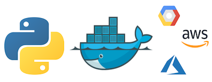
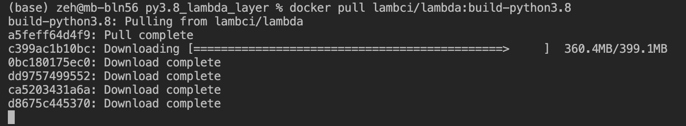
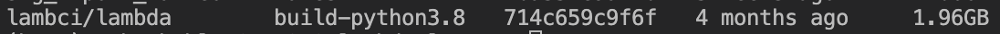
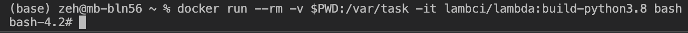

# Create a Python (Lambda) Layer using Docker

## Prerequisites
* Download and install Docker Desktop [here](https://www.docker.com/products/docker-desktop)
* Verify Installation:
``` bash
docker --version
```
## Get the Docker Image
Depending on which Python Runtime your application uses you can pull various runtime images. In this case we're going with Python 3.8:
```bash
docker pull lambci/lambda:build-python3.8
```


After all downloads have been completed our image is created. We can check this by running:
```bash
docker images
```


Now we can bash into our image:
```bash
docker run --rm -v $PWD:/var/task -it lambci/lambda:build-python3.8 bash
```
* docker run --rm will run the container and remove it after it terminates
* -v creates a volume inside the container from your current directory to /var/task inside the running container
* lambci/lambda:build-python3.8 is the python 3.8 runtime image



Create a new directory for the python packages:
```bash
mkdir python_packages
```
OR

Empty the python_packages directory if it already exists just in case packages from previous runs are still in there:
```bash
rm -rf  python_packages/*
```

Now we can use the requirements.txt to install our required packages to `/python_packages`:
```bash
pip install -r requirements.txt -t ./python_packages
```

Zip the created packages:
```bash
cd python_packages
zip -r lambda_layer.zip *
```

Now you only need to upload the zip file to your lambda layer. Please note:
* You can only use up to 5 layers per Lambda
* The size of all your layers unzipped cannot exceed 250mb
